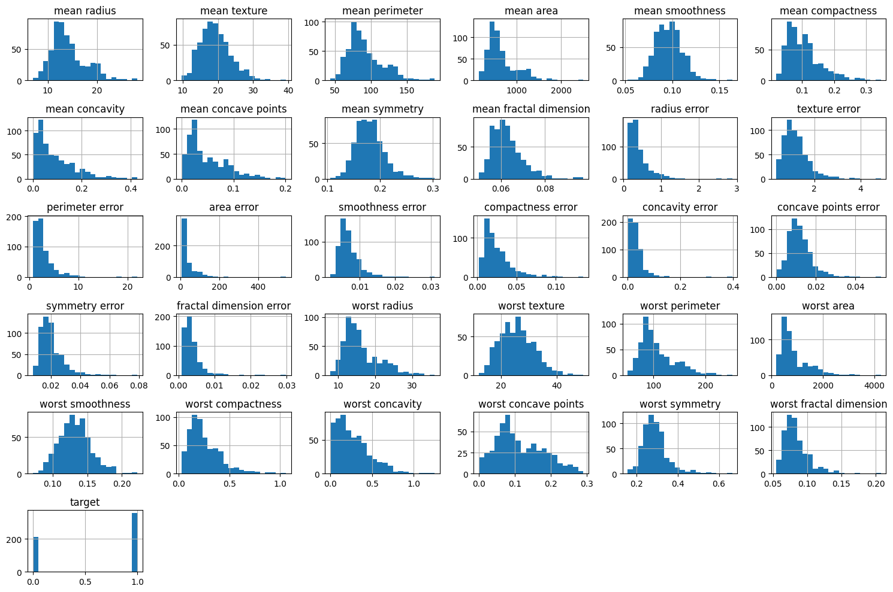

# Introduction to Classification

## What is Classification?

Classification is a type of supervised learning where the goal is to predict categorical class labels. Given input data, a classification model attempts to assign it to one of several predefined classes.

Some examples include:
- Email spam detection (spam vs. not spam)
- Disease diagnosis (positive vs. negative)
- Image recognition (cat, dog, or other)

## Workshop Goals

By the end of this workshop, you will be able to:
- Understand common classification algorithms
- Apply them using Scikit-Learn, NumPy, Pandas, and Matplotlib
- Evaluate and optimise models


## Topics Covered

1. Logistic Regression
2. Support Vector Machines (SVM)
3. Model Evaluation: Accuracy, Precision, Recall, F1-Score, ROC-AUC
4. Neural Networks (MLPClassifier)
5. Random Forest Classifier 
6. Optimisation and Tuning

## Required Libraries

We will use the following Python libraries throughout the workshop:
- `NumPy` – numerical operations
- `Pandas` – data manipulation
- `Scikit-Learn` – machine learning models and tools
- `Matplotlib` – data visualisation
- `Seaborn` - data visualisation


---

Let's get started! 🚀


### Installing Libraries

Uncomment and run the commands below only if packages are not installed. 

```python
# !pip install numpy
# !pip install pandas
# !pip install scikit-learn
# !pip install matplotlib
# !pip install seaborn

```

### Check your environment has the necessary libraries installed

```python
import numpy
print("NumPy version:", numpy.__version__)

import pandas
print("Pandas version:", pandas.__version__)

import sklearn
print("sklearn version:", sklearn.__version__)

import matplotlib
print("matplotlib version:", matplotlib.__version__)

import seaborn
print("sklearn version:", seaborn.__version__)
```

    NumPy version: 2.2.6
    Pandas version: 2.2.3
    sklearn version: 1.7.0
    matplotlib version: 3.10.3
    sklearn version: 0.13.2


```python
import numpy as np
import pandas as pd
import matplotlib.pyplot as plt
from sklearn import datasets

```

### Preview Example Dataset
We use the `load_breast_cancer()` dataset from Scikit-Learn. It includes 30 numeric features extracted from breast mass images.

```python
from sklearn.datasets import load_breast_cancer
import pandas as pd

data = load_breast_cancer()
X = data.data
y = data.target

df = pd.DataFrame(X, columns=data.feature_names)
df['target'] = y
df.head()
```


<div>
<style scoped>
    .dataframe tbody tr th:only-of-type {
        vertical-align: middle;
    }

    .dataframe tbody tr th {
        vertical-align: top;
    }

    .dataframe thead th {
        text-align: right;
    }
</style>
<table border="1" class="dataframe">
  <thead>
    <tr style="text-align: right;">
      <th></th>
      <th>mean radius</th>
      <th>mean texture</th>
      <th>mean perimeter</th>
      <th>mean area</th>
      <th>mean smoothness</th>
      <th>mean compactness</th>
      <th>mean concavity</th>
      <th>mean concave points</th>
      <th>mean symmetry</th>
      <th>mean fractal dimension</th>
      <th>...</th>
      <th>worst texture</th>
      <th>worst perimeter</th>
      <th>worst area</th>
      <th>worst smoothness</th>
      <th>worst compactness</th>
      <th>worst concavity</th>
      <th>worst concave points</th>
      <th>worst symmetry</th>
      <th>worst fractal dimension</th>
      <th>target</th>
    </tr>
  </thead>
  <tbody>
    <tr>
      <th>0</th>
      <td>17.99</td>
      <td>10.38</td>
      <td>122.80</td>
      <td>1001.0</td>
      <td>0.11840</td>
      <td>0.27760</td>
      <td>0.3001</td>
      <td>0.14710</td>
      <td>0.2419</td>
      <td>0.07871</td>
      <td>...</td>
      <td>17.33</td>
      <td>184.60</td>
      <td>2019.0</td>
      <td>0.1622</td>
      <td>0.6656</td>
      <td>0.7119</td>
      <td>0.2654</td>
      <td>0.4601</td>
      <td>0.11890</td>
      <td>0</td>
    </tr>
    <tr>
      <th>1</th>
      <td>20.57</td>
      <td>17.77</td>
      <td>132.90</td>
      <td>1326.0</td>
      <td>0.08474</td>
      <td>0.07864</td>
      <td>0.0869</td>
      <td>0.07017</td>
      <td>0.1812</td>
      <td>0.05667</td>
      <td>...</td>
      <td>23.41</td>
      <td>158.80</td>
      <td>1956.0</td>
      <td>0.1238</td>
      <td>0.1866</td>
      <td>0.2416</td>
      <td>0.1860</td>
      <td>0.2750</td>
      <td>0.08902</td>
      <td>0</td>
    </tr>
    <tr>
      <th>2</th>
      <td>19.69</td>
      <td>21.25</td>
      <td>130.00</td>
      <td>1203.0</td>
      <td>0.10960</td>
      <td>0.15990</td>
      <td>0.1974</td>
      <td>0.12790</td>
      <td>0.2069</td>
      <td>0.05999</td>
      <td>...</td>
      <td>25.53</td>
      <td>152.50</td>
      <td>1709.0</td>
      <td>0.1444</td>
      <td>0.4245</td>
      <td>0.4504</td>
      <td>0.2430</td>
      <td>0.3613</td>
      <td>0.08758</td>
      <td>0</td>
    </tr>
    <tr>
      <th>3</th>
      <td>11.42</td>
      <td>20.38</td>
      <td>77.58</td>
      <td>386.1</td>
      <td>0.14250</td>
      <td>0.28390</td>
      <td>0.2414</td>
      <td>0.10520</td>
      <td>0.2597</td>
      <td>0.09744</td>
      <td>...</td>
      <td>26.50</td>
      <td>98.87</td>
      <td>567.7</td>
      <td>0.2098</td>
      <td>0.8663</td>
      <td>0.6869</td>
      <td>0.2575</td>
      <td>0.6638</td>
      <td>0.17300</td>
      <td>0</td>
    </tr>
    <tr>
      <th>4</th>
      <td>20.29</td>
      <td>14.34</td>
      <td>135.10</td>
      <td>1297.0</td>
      <td>0.10030</td>
      <td>0.13280</td>
      <td>0.1980</td>
      <td>0.10430</td>
      <td>0.1809</td>
      <td>0.05883</td>
      <td>...</td>
      <td>16.67</td>
      <td>152.20</td>
      <td>1575.0</td>
      <td>0.1374</td>
      <td>0.2050</td>
      <td>0.4000</td>
      <td>0.1625</td>
      <td>0.2364</td>
      <td>0.07678</td>
      <td>0</td>
    </tr>
  </tbody>
</table>
<p>5 rows × 31 columns</p>
</div>


```python
df.describe()
```


<div>
<style scoped>
    .dataframe tbody tr th:only-of-type {
        vertical-align: middle;
    }

    .dataframe tbody tr th {
        vertical-align: top;
    }

    .dataframe thead th {
        text-align: right;
    }
</style>
<table border="1" class="dataframe">
  <thead>
    <tr style="text-align: right;">
      <th></th>
      <th>mean radius</th>
      <th>mean texture</th>
      <th>mean perimeter</th>
      <th>mean area</th>
      <th>mean smoothness</th>
      <th>mean compactness</th>
      <th>mean concavity</th>
      <th>mean concave points</th>
      <th>mean symmetry</th>
      <th>mean fractal dimension</th>
      <th>...</th>
      <th>worst texture</th>
      <th>worst perimeter</th>
      <th>worst area</th>
      <th>worst smoothness</th>
      <th>worst compactness</th>
      <th>worst concavity</th>
      <th>worst concave points</th>
      <th>worst symmetry</th>
      <th>worst fractal dimension</th>
      <th>target</th>
    </tr>
  </thead>
  <tbody>
    <tr>
      <th>count</th>
      <td>569.000000</td>
      <td>569.000000</td>
      <td>569.000000</td>
      <td>569.000000</td>
      <td>569.000000</td>
      <td>569.000000</td>
      <td>569.000000</td>
      <td>569.000000</td>
      <td>569.000000</td>
      <td>569.000000</td>
      <td>...</td>
      <td>569.000000</td>
      <td>569.000000</td>
      <td>569.000000</td>
      <td>569.000000</td>
      <td>569.000000</td>
      <td>569.000000</td>
      <td>569.000000</td>
      <td>569.000000</td>
      <td>569.000000</td>
      <td>569.000000</td>
    </tr>
    <tr>
      <th>mean</th>
      <td>14.127292</td>
      <td>19.289649</td>
      <td>91.969033</td>
      <td>654.889104</td>
      <td>0.096360</td>
      <td>0.104341</td>
      <td>0.088799</td>
      <td>0.048919</td>
      <td>0.181162</td>
      <td>0.062798</td>
      <td>...</td>
      <td>25.677223</td>
      <td>107.261213</td>
      <td>880.583128</td>
      <td>0.132369</td>
      <td>0.254265</td>
      <td>0.272188</td>
      <td>0.114606</td>
      <td>0.290076</td>
      <td>0.083946</td>
      <td>0.627417</td>
    </tr>
    <tr>
      <th>std</th>
      <td>3.524049</td>
      <td>4.301036</td>
      <td>24.298981</td>
      <td>351.914129</td>
      <td>0.014064</td>
      <td>0.052813</td>
      <td>0.079720</td>
      <td>0.038803</td>
      <td>0.027414</td>
      <td>0.007060</td>
      <td>...</td>
      <td>6.146258</td>
      <td>33.602542</td>
      <td>569.356993</td>
      <td>0.022832</td>
      <td>0.157336</td>
      <td>0.208624</td>
      <td>0.065732</td>
      <td>0.061867</td>
      <td>0.018061</td>
      <td>0.483918</td>
    </tr>
    <tr>
      <th>min</th>
      <td>6.981000</td>
      <td>9.710000</td>
      <td>43.790000</td>
      <td>143.500000</td>
      <td>0.052630</td>
      <td>0.019380</td>
      <td>0.000000</td>
      <td>0.000000</td>
      <td>0.106000</td>
      <td>0.049960</td>
      <td>...</td>
      <td>12.020000</td>
      <td>50.410000</td>
      <td>185.200000</td>
      <td>0.071170</td>
      <td>0.027290</td>
      <td>0.000000</td>
      <td>0.000000</td>
      <td>0.156500</td>
      <td>0.055040</td>
      <td>0.000000</td>
    </tr>
    <tr>
      <th>25%</th>
      <td>11.700000</td>
      <td>16.170000</td>
      <td>75.170000</td>
      <td>420.300000</td>
      <td>0.086370</td>
      <td>0.064920</td>
      <td>0.029560</td>
      <td>0.020310</td>
      <td>0.161900</td>
      <td>0.057700</td>
      <td>...</td>
      <td>21.080000</td>
      <td>84.110000</td>
      <td>515.300000</td>
      <td>0.116600</td>
      <td>0.147200</td>
      <td>0.114500</td>
      <td>0.064930</td>
      <td>0.250400</td>
      <td>0.071460</td>
      <td>0.000000</td>
    </tr>
    <tr>
      <th>50%</th>
      <td>13.370000</td>
      <td>18.840000</td>
      <td>86.240000</td>
      <td>551.100000</td>
      <td>0.095870</td>
      <td>0.092630</td>
      <td>0.061540</td>
      <td>0.033500</td>
      <td>0.179200</td>
      <td>0.061540</td>
      <td>...</td>
      <td>25.410000</td>
      <td>97.660000</td>
      <td>686.500000</td>
      <td>0.131300</td>
      <td>0.211900</td>
      <td>0.226700</td>
      <td>0.099930</td>
      <td>0.282200</td>
      <td>0.080040</td>
      <td>1.000000</td>
    </tr>
    <tr>
      <th>75%</th>
      <td>15.780000</td>
      <td>21.800000</td>
      <td>104.100000</td>
      <td>782.700000</td>
      <td>0.105300</td>
      <td>0.130400</td>
      <td>0.130700</td>
      <td>0.074000</td>
      <td>0.195700</td>
      <td>0.066120</td>
      <td>...</td>
      <td>29.720000</td>
      <td>125.400000</td>
      <td>1084.000000</td>
      <td>0.146000</td>
      <td>0.339100</td>
      <td>0.382900</td>
      <td>0.161400</td>
      <td>0.317900</td>
      <td>0.092080</td>
      <td>1.000000</td>
    </tr>
    <tr>
      <th>max</th>
      <td>28.110000</td>
      <td>39.280000</td>
      <td>188.500000</td>
      <td>2501.000000</td>
      <td>0.163400</td>
      <td>0.345400</td>
      <td>0.426800</td>
      <td>0.201200</td>
      <td>0.304000</td>
      <td>0.097440</td>
      <td>...</td>
      <td>49.540000</td>
      <td>251.200000</td>
      <td>4254.000000</td>
      <td>0.222600</td>
      <td>1.058000</td>
      <td>1.252000</td>
      <td>0.291000</td>
      <td>0.663800</td>
      <td>0.207500</td>
      <td>1.000000</td>
    </tr>
  </tbody>
</table>
<p>8 rows × 31 columns</p>
</div>


```python
df.hist(bins=20, figsize=(15, 10))
plt.tight_layout()
```


    

    


```python
from sklearn.preprocessing import StandardScaler

# Apply StandardScaler
scaler = StandardScaler()
df_scaled = pd.DataFrame(scaler.fit_transform(df), columns=df.columns, index=df.index)
df_scaled.describe()


```


<div>
<style scoped>
    .dataframe tbody tr th:only-of-type {
        vertical-align: middle;
    }

    .dataframe tbody tr th {
        vertical-align: top;
    }

    .dataframe thead th {
        text-align: right;
    }
</style>
<table border="1" class="dataframe">
  <thead>
    <tr style="text-align: right;">
      <th></th>
      <th>mean radius</th>
      <th>mean texture</th>
      <th>mean perimeter</th>
      <th>mean area</th>
      <th>mean smoothness</th>
      <th>mean compactness</th>
      <th>mean concavity</th>
      <th>mean concave points</th>
      <th>mean symmetry</th>
      <th>mean fractal dimension</th>
      <th>...</th>
      <th>worst texture</th>
      <th>worst perimeter</th>
      <th>worst area</th>
      <th>worst smoothness</th>
      <th>worst compactness</th>
      <th>worst concavity</th>
      <th>worst concave points</th>
      <th>worst symmetry</th>
      <th>worst fractal dimension</th>
      <th>target</th>
    </tr>
  </thead>
  <tbody>
    <tr>
      <th>count</th>
      <td>5.690000e+02</td>
      <td>5.690000e+02</td>
      <td>5.690000e+02</td>
      <td>5.690000e+02</td>
      <td>5.690000e+02</td>
      <td>5.690000e+02</td>
      <td>5.690000e+02</td>
      <td>5.690000e+02</td>
      <td>5.690000e+02</td>
      <td>5.690000e+02</td>
      <td>...</td>
      <td>5.690000e+02</td>
      <td>5.690000e+02</td>
      <td>569.000000</td>
      <td>5.690000e+02</td>
      <td>5.690000e+02</td>
      <td>5.690000e+02</td>
      <td>5.690000e+02</td>
      <td>5.690000e+02</td>
      <td>5.690000e+02</td>
      <td>5.690000e+02</td>
    </tr>
    <tr>
      <th>mean</th>
      <td>-1.373633e-16</td>
      <td>6.868164e-17</td>
      <td>-1.248757e-16</td>
      <td>-2.185325e-16</td>
      <td>-8.366672e-16</td>
      <td>1.873136e-16</td>
      <td>4.995028e-17</td>
      <td>-4.995028e-17</td>
      <td>1.748260e-16</td>
      <td>4.745277e-16</td>
      <td>...</td>
      <td>1.248757e-17</td>
      <td>-3.746271e-16</td>
      <td>0.000000</td>
      <td>-2.372638e-16</td>
      <td>-3.371644e-16</td>
      <td>7.492542e-17</td>
      <td>2.247763e-16</td>
      <td>2.622390e-16</td>
      <td>-5.744282e-16</td>
      <td>-4.995028e-17</td>
    </tr>
    <tr>
      <th>std</th>
      <td>1.000880e+00</td>
      <td>1.000880e+00</td>
      <td>1.000880e+00</td>
      <td>1.000880e+00</td>
      <td>1.000880e+00</td>
      <td>1.000880e+00</td>
      <td>1.000880e+00</td>
      <td>1.000880e+00</td>
      <td>1.000880e+00</td>
      <td>1.000880e+00</td>
      <td>...</td>
      <td>1.000880e+00</td>
      <td>1.000880e+00</td>
      <td>1.000880</td>
      <td>1.000880e+00</td>
      <td>1.000880e+00</td>
      <td>1.000880e+00</td>
      <td>1.000880e+00</td>
      <td>1.000880e+00</td>
      <td>1.000880e+00</td>
      <td>1.000880e+00</td>
    </tr>
    <tr>
      <th>min</th>
      <td>-2.029648e+00</td>
      <td>-2.229249e+00</td>
      <td>-1.984504e+00</td>
      <td>-1.454443e+00</td>
      <td>-3.112085e+00</td>
      <td>-1.610136e+00</td>
      <td>-1.114873e+00</td>
      <td>-1.261820e+00</td>
      <td>-2.744117e+00</td>
      <td>-1.819865e+00</td>
      <td>...</td>
      <td>-2.223994e+00</td>
      <td>-1.693361e+00</td>
      <td>-1.222423</td>
      <td>-2.682695e+00</td>
      <td>-1.443878e+00</td>
      <td>-1.305831e+00</td>
      <td>-1.745063e+00</td>
      <td>-2.160960e+00</td>
      <td>-1.601839e+00</td>
      <td>-1.297676e+00</td>
    </tr>
    <tr>
      <th>25%</th>
      <td>-6.893853e-01</td>
      <td>-7.259631e-01</td>
      <td>-6.919555e-01</td>
      <td>-6.671955e-01</td>
      <td>-7.109628e-01</td>
      <td>-7.470860e-01</td>
      <td>-7.437479e-01</td>
      <td>-7.379438e-01</td>
      <td>-7.032397e-01</td>
      <td>-7.226392e-01</td>
      <td>...</td>
      <td>-7.486293e-01</td>
      <td>-6.895783e-01</td>
      <td>-0.642136</td>
      <td>-6.912304e-01</td>
      <td>-6.810833e-01</td>
      <td>-7.565142e-01</td>
      <td>-7.563999e-01</td>
      <td>-6.418637e-01</td>
      <td>-6.919118e-01</td>
      <td>-1.297676e+00</td>
    </tr>
    <tr>
      <th>50%</th>
      <td>-2.150816e-01</td>
      <td>-1.046362e-01</td>
      <td>-2.359800e-01</td>
      <td>-2.951869e-01</td>
      <td>-3.489108e-02</td>
      <td>-2.219405e-01</td>
      <td>-3.422399e-01</td>
      <td>-3.977212e-01</td>
      <td>-7.162650e-02</td>
      <td>-1.782793e-01</td>
      <td>...</td>
      <td>-4.351564e-02</td>
      <td>-2.859802e-01</td>
      <td>-0.341181</td>
      <td>-4.684277e-02</td>
      <td>-2.695009e-01</td>
      <td>-2.182321e-01</td>
      <td>-2.234689e-01</td>
      <td>-1.274095e-01</td>
      <td>-2.164441e-01</td>
      <td>7.706085e-01</td>
    </tr>
    <tr>
      <th>75%</th>
      <td>4.693926e-01</td>
      <td>5.841756e-01</td>
      <td>4.996769e-01</td>
      <td>3.635073e-01</td>
      <td>6.361990e-01</td>
      <td>4.938569e-01</td>
      <td>5.260619e-01</td>
      <td>6.469351e-01</td>
      <td>5.307792e-01</td>
      <td>4.709834e-01</td>
      <td>...</td>
      <td>6.583411e-01</td>
      <td>5.402790e-01</td>
      <td>0.357589</td>
      <td>5.975448e-01</td>
      <td>5.396688e-01</td>
      <td>5.311411e-01</td>
      <td>7.125100e-01</td>
      <td>4.501382e-01</td>
      <td>4.507624e-01</td>
      <td>7.706085e-01</td>
    </tr>
    <tr>
      <th>max</th>
      <td>3.971288e+00</td>
      <td>4.651889e+00</td>
      <td>3.976130e+00</td>
      <td>5.250529e+00</td>
      <td>4.770911e+00</td>
      <td>4.568425e+00</td>
      <td>4.243589e+00</td>
      <td>3.927930e+00</td>
      <td>4.484751e+00</td>
      <td>4.910919e+00</td>
      <td>...</td>
      <td>3.885905e+00</td>
      <td>4.287337e+00</td>
      <td>5.930172</td>
      <td>3.955374e+00</td>
      <td>5.112877e+00</td>
      <td>4.700669e+00</td>
      <td>2.685877e+00</td>
      <td>6.046041e+00</td>
      <td>6.846856e+00</td>
      <td>7.706085e-01</td>
    </tr>
  </tbody>
</table>
<p>8 rows × 31 columns</p>
</div>


